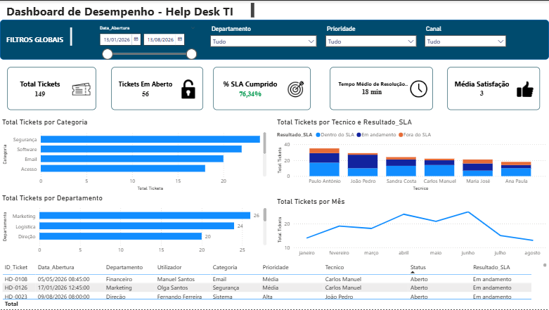

# Help Desk Analytics

Dashboard desenvolvido em Power BI para análise de desempenho de uma operação de Help Desk.

## 📊 Dashboard



## 🎯 Objetivo do projeto

Este projeto tem como objetivo analisar os chamados de suporte técnico, permitindo identificar padrões, acompanhar indicadores de desempenho e apoiar a tomada de decisões baseada em dados.
## 📌 Sobre o projeto

Projeto desenvolvido para portfólio profissional, com foco no desenvolvimento de competências práticas em Data Analytics e Business Intelligence, utilizando um cenário de suporte técnico/Help Desk.

O projeto demonstra o processo desde a preparação dos dados até à criação de indicadores, visualizações e interpretação dos resultados.


## 🛠️ Ferramentas utilizadas

- Power BI
- Power Query
- DAX
- Microsoft Excel

## 📈 Principais indicadores

- Total de chamados
- Chamados resolvidos
- Chamados pendentes
- Tempo médio de resolução
- Taxa de resolução
- Satisfação dos utilizadores

## 🔎 Análises realizadas

- Volume de chamados por período
- Distribuição dos chamados por prioridade
- Chamados por categoria
- Desempenho dos agentes
- Tempo de resolução
- Evolução dos chamados ao longo do tempo

## 📁 Estrutura do projeto

```text
Help-Desk-Analytics/
├── dashboard/
│   └── Help_Desk_Analytics.pbix
├── images/

```
## 👩‍💻 Autora

**Alegria Distinto Gabriel**

Projeto desenvolvido para portfólio profissional na área de Análise de Dados.
